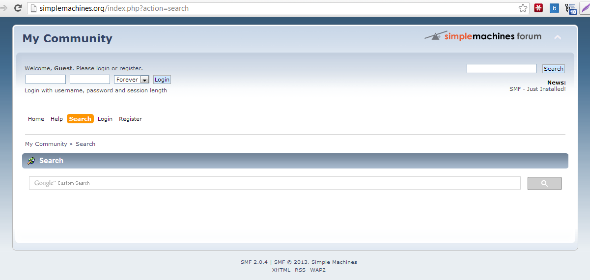
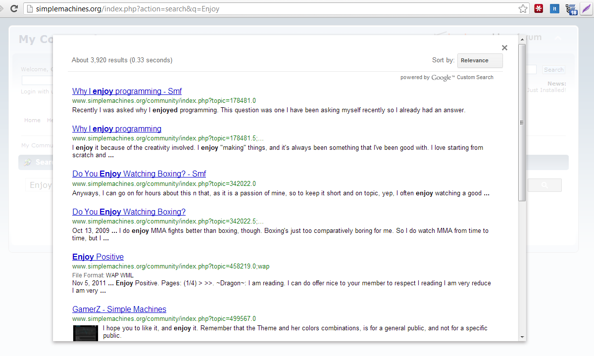
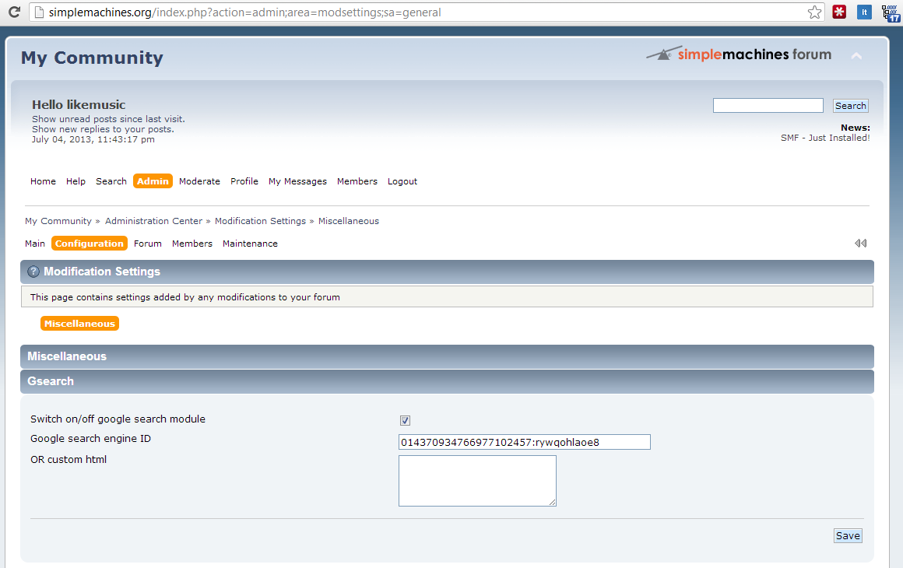

# SMF-GSearch
Build-in google search engine for [SMF](http://www.simplemachines.org/)

# Warning!!!

This plugin was written in 2013. The information described here can be (veratnet all) is deprecated. Code posted as an example of my code for job search.

# Screenshots

# Appreciation

This library sponsored and requested by [Hosting company 2by2host](http://www.2by2host.com/) and [Aimbox](http://aimbox.com/).

# Licence
The MIT License (MIT).
